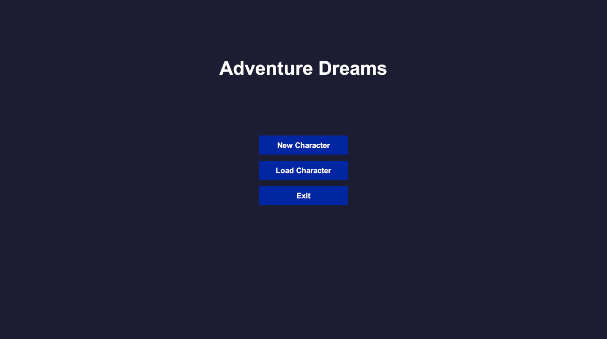
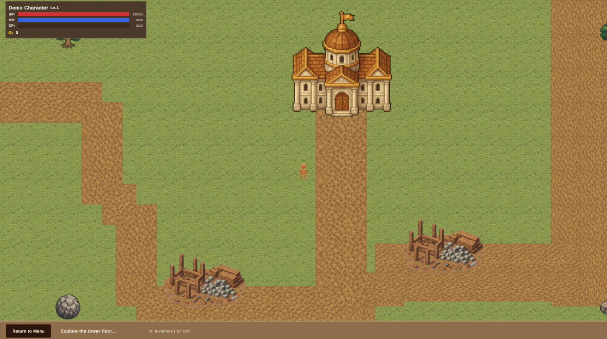

# Engineering an Indie Game — Part 1  
### Why I Started Building an Indie Game

Eight months ago I started building an indie game.

I didn’t announce it.  
I didn’t post screenshots.  
I didn’t even tell many people.

For most of my career — almost two decades now — I’ve worked as a software engineer building backend systems and large-scale platforms across domains such as finance, education, e-commerce, and data services.

But I’ve always loved games.

At some point last year I decided to try something different:

**Build one myself.**

Not a prototype.  
Not a weekend experiment.

A real game.

So for the last eight months I’ve been working nights and weekends on a project called **Adventure Dreams**, a top-down pixel-art RPG.

It’s the kind of adventure game I loved playing growing up — exploration, discovery, and a world that slowly unfolds.

The funny part is that I didn’t start with art.

I started the way engineers tend to start things:

- defining systems  
- structuring the architecture  
- designing the core gameplay loop  
- building tools and pipelines  

Only recently did I start tackling what might be my biggest challenge so far: **creating a visual identity for the game.**

That’s also when I realized something:

If I want this project to actually ship, I need to start sharing the journey.

So this series will document what happens when a software engineer tries to build an indie game — including:

- architecture decisions  
- solo development challenges  
- using AI tools to accelerate development  
- learning disciplines far outside my comfort zone  
- and the long road from idea → playable game  

I’m not sure where this will end.

But I think the journey itself will be worth sharing.

<table>
  <tr>
    <td>
      <figure>
        
        <figcaption>Early playable menu prototype with placeholder assets.</figcaption>
      </figure>
    </td>
    <td>
      <figure>
        
        <figcaption>Early playable home town prototype with placeholder assets.</figcaption>
      </figure>
    </td>
  </tr>
</table>

**Part 2 will be about the first mistake I intentionally avoided when starting the project.**

Have you ever tried building something completely outside your professional field? What pushed you to start?

—  
Engineering an Indie Game is a series documenting my journey building Adventure Dreams.

Part engineering journal, part devlog, part learning process.

Full archive: [GitHub](https://github.com/gugalp/engineering-an-indie-game)
